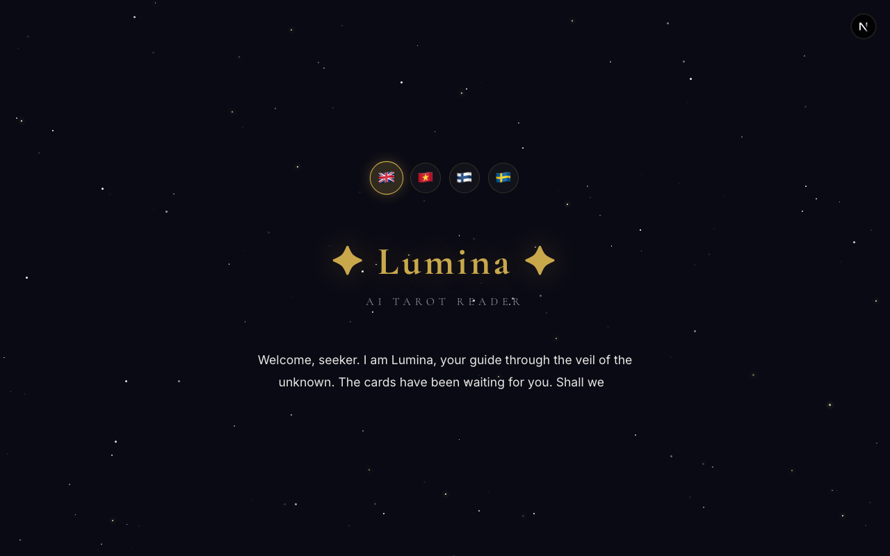
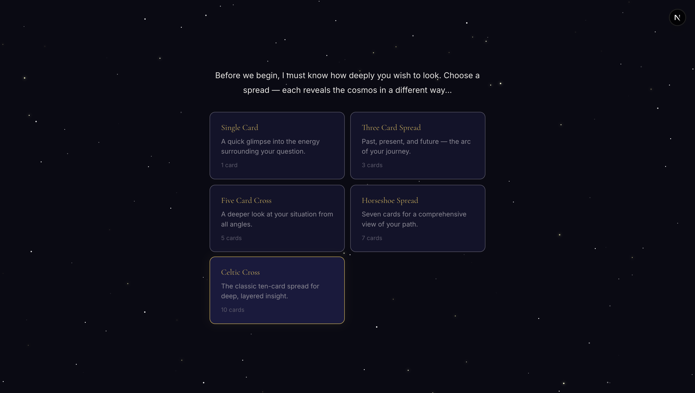
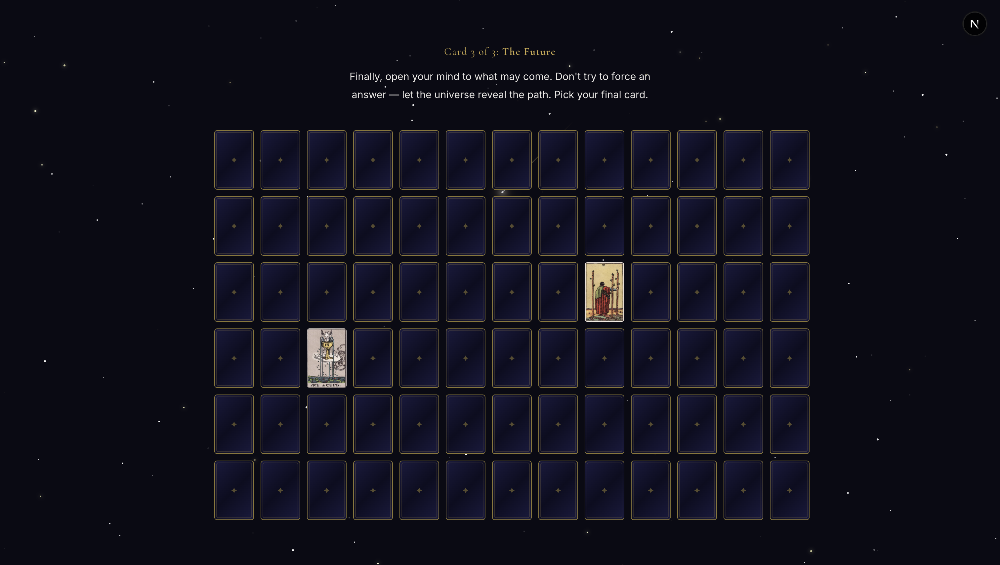
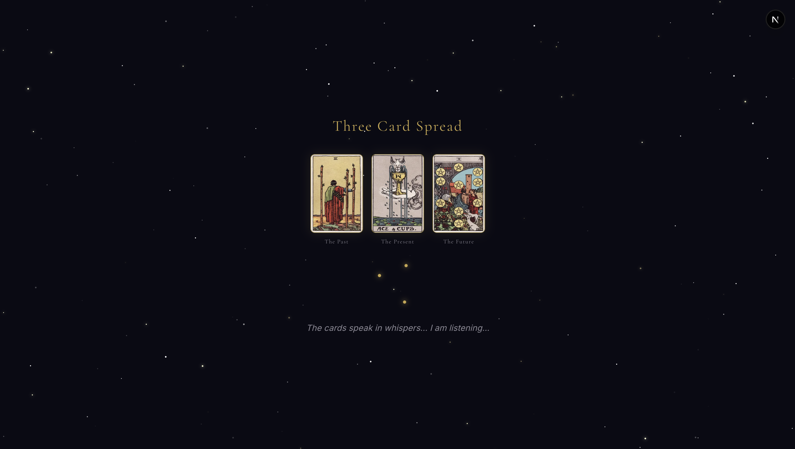
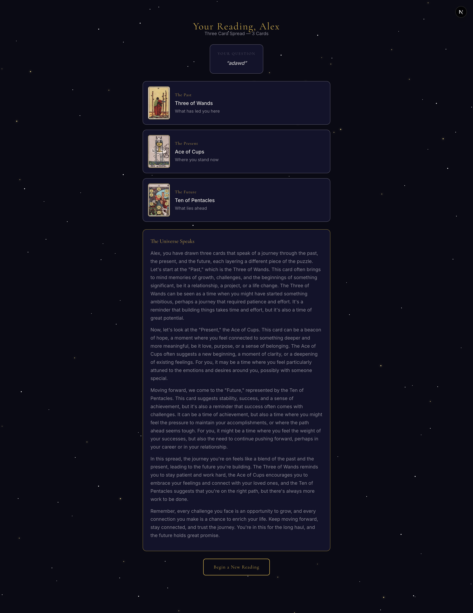

# Lumina ✦ The Virtual Oracle

Lumina is a mystical portal designed to bring the ancient wisdom of tarot into our digital world. It uses artificial intelligence to offer you thoughtful and personal readings while keeping everything private on your own computer. Step into an immersive space where technology and intuition meet to guide you through your deepest questions.

## Functions:
- **Guided Tarot Spreads**: Pick from a range of layouts like the Single Card, the Three Card journey through time, the Five Card Cross, the Horseshoe, or the detailed Celtic Cross.
- **The Minds Behind the Magic**: Lumina is powered by a specialized version of the Qwen 2 language model. This intelligence has been fine tuned specifically to understand the symbolism and emotional depth of tarot cards.
- **Completely Private Readings**: Unlike many other tools, your interpretations are generated right in your browser. This means your private thoughts and readings stay on your device and are never sent away to a server.
- **A Personal Touch**: You can share a bit about yourself—like your name or what is on your mind—to help Lumina create a reading that truly speaks to your life.
- **Global Wisdom**: Experience the oracle in several different languages, including English, Vietnamese, Finnish, and Swedish.
- **Ethereal Atmosphere**: Lose yourself in a world of moving star fields, gentle typing effects, and a design that feels like a quiet dream.

## The Intelligence of Lumina

At the heart of Lumina is a high performance language model that lives entirely within your web browser. Here is how it works:

- **Specialized Training**: We use a fine tuned model based on the Qwen2.5-3B-Instruct model. It was trained on thousands of tarot readings to ensure it speaks with a voice that is both mystical and deeply empathetic.
- **Local Power with WebGPU**: By using WebGPU, Lumina can tap into the power of your computer's graphics hardware to run the AI quickly. This allows for a smooth and responsive experience without needing an internet connection once the model is loaded.
- **Invisible Execution**: To keep the interface feeling light and fast, the AI runs in a background worker. This means the stars can keep moving and the animations stay smooth while the oracle is thinking and writing your reading.

## Technologies used

Languages:
- **TypeScript** (Building the core logic)

Libraries and frameworks:
- [**Next.js 15**](https://nextjs.org/) - A powerful framework for a smooth web experience.
- [**React 19**](https://react.dev/) - The tool we used to build the interface.
- [**Web LLM**](https://webllm.mlc.ai/) - The engine that lets the AI run locally in your browser.
- [**Tailwind CSS**](https://tailwindcss.com/) - Helping us perfect the layout.

## Setup and usage

**Explore the live page [here](https://tarot.alextran.dev/)**

**To set up the project yourself**
- Download the code: ```git clone https://github.com/alextrandev/lumina.git```
- Go into the project folder: ```cd lumina```
- Install what is needed: ```npm install```
- Start the site locally: ```npm run dev```

## Screenshot

**Homepage**


**Spread Selection**


**Picking cards**


**Card reading**


**Result of the spread**


## Sources 

- [AI Model used for this project: Qwen2.5-3B-Instruct](https://huggingface.co/Qwen/Qwen2.5-3B-Instruct)
- [Data set used for fine-tuning](https://huggingface.co/datasets/barissglc/tarot)
